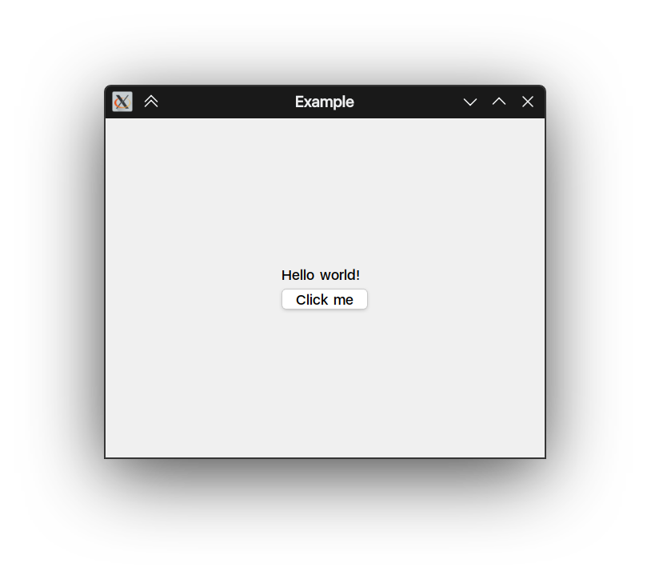

# aui.bindings.lua

This project provides Lua bindings for the AUI Framework. It allows to use C++ objects from Lua and et cetera. You can
build an AUI application entirely in Lua, as well as incorporate scripted Lua views into existing AUI layouts.

# Building

1. Clone the repository:

``` bash
    git clone https://github.com/aui-framework/bindings-lua.git
    cd bindings-lua
```
2. Create a build directory:

``` bash
    mkdir build
    cd build
```
3. Configure the build using CMake:

``` bash
    cmake ..
```
4. Build the project:

``` bash
    cmake --build .
```

# Example



You can optionally build examples by setting the option to `TRUE` during CMake configuration: `AUI_LUA_BUILD_EXAMPLES`

``` bash
cmake .. -DAUI_LUA_BUILD_EXAMPLES=TRUE
```
The `examples` directory contains a basic example that demonstrates how to create a simple AUI window using Lua.

# Contributing
Contributions are welcome! Please submit bug reports and feature requests through the GitHub issue tracker. Pull
requests are also welcome.
